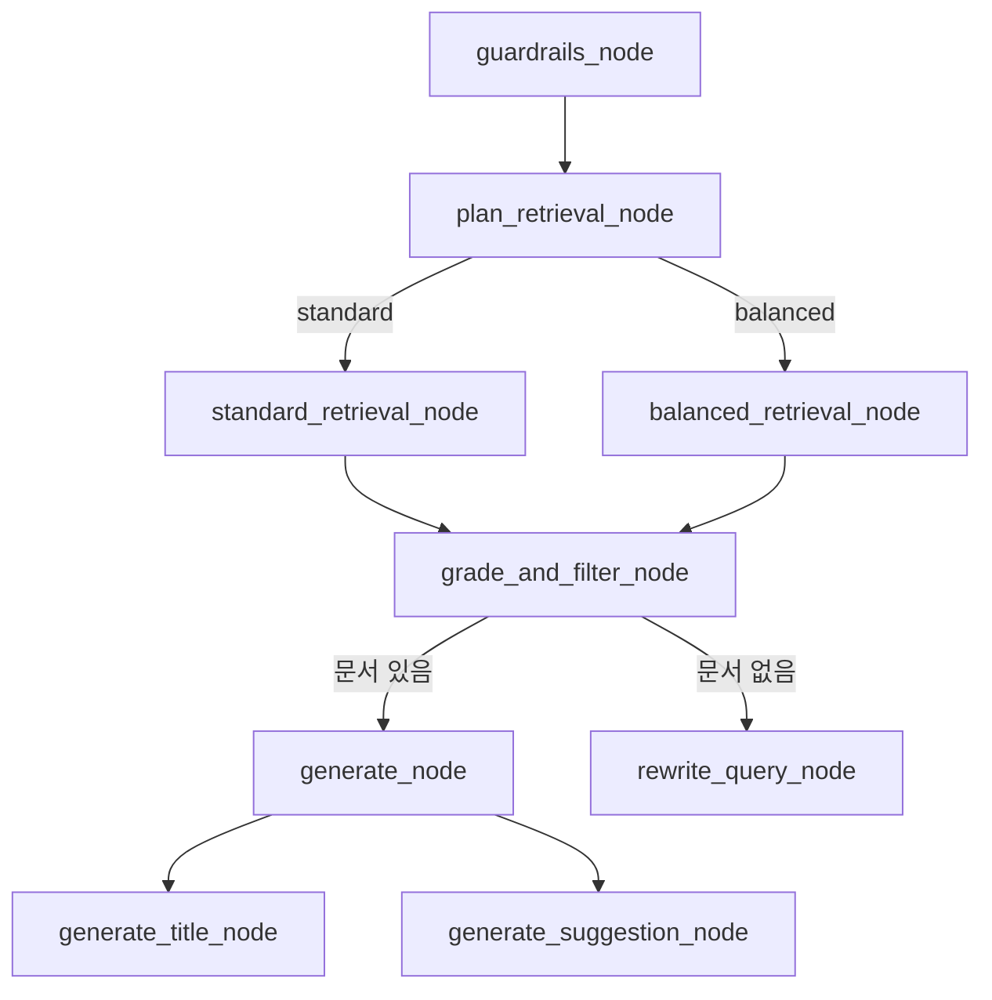

# 🧩 node/ 폴더 구조 및 LangGraph 노드별 GraphState 변화

이 문서는 `node/` 폴더 내 각 노드가 LangGraph 파이프라인에서 어떤 역할을 하며,  
**매 분기마다 `GraphState`가 어떻게 변화하는지**를 단계별로 설명합니다.

---

## 📦 GraphState 구조

`GraphState`는 파이프라인 전체에서 상태(state)를 전달하는 핵심 딕셔너리입니다.

```python
class GraphState(TypedDict):
    question: str                # 현재 검색/생성에 사용되는 질문
    original_question: str       # 사용자의 원본 질문
    plan: Optional[dict]         # 검색 전략 및 파라미터
    documents: List[Document]    # 검색된 문서 리스트
    generation: str              # 최종 생성 결과(답변 등)
    context: str                 # 문서 본문 등 컨텍스트
    retries: int                 # 질문 재작성 시도 횟수
    doc_id: Optional[str]        # (선택) 특정 문서 ID
    suggestion: Optional[str]    # (선택) 추가 제안
    value_type: Optional[str]    # (선택) 생성 결과 타입(title, content 등)
    apply_value: Optional[str]   # (선택) 실제 적용 값(예: 추천 제목)
```

---

## 🚦 노드별 GraphState 변화 흐름

### 1️⃣ **01_guardrails/**
- **prompt_injection.py / analyze_bias.py**
  - **입력**: `question`
  - **출력**:  
    - `generation`: 프롬프트 인젝션/편향 감지 시 오류 메시지  
    - (문제 없으면 state 변화 없음)

---

### 2️⃣ **02_plan/plan_retrieval_node.py**
- **입력**:  
  - `question`
- **출력**:  
  - `plan`: LLM이 생성한 검색 전략/필터/파라미터 dict  
  - (예시)
    ```json
    {
      "strategy": "standard_retrieval",
      "data_type": ["기사"],
      "rewritten_question": "부동산 정책",
      "filters": {"startdate": "2024-06-01", "enddate": "2024-07-01"},
      "parameters": {"k": 5}
    }
    ```
  - 기존 필드는 유지

---

### 3️⃣ **03_retrieval/standard_retrieval_node.py, balanced_retrieval_node.py**
- **입력**:  
  - `plan`
- **출력**:  
  - `documents`: 검색된 문서 리스트  
  - 기존 state의 다른 필드는 유지

---

### 4️⃣ **03_retrieval/grade_and_filter_node.py**
- **입력**:  
  - `documents`
  - `original_question`
- **출력**:  
  - `documents`: LLM 평가 후 유용한 문서만 남김  
  - (없으면 빈 리스트)

---

### 5️⃣ **03_context/detect_chage.py** (옵션)
- **입력**:  
  - 문서 전체 내용
- **출력**:  
  - 변경 감지 결과(필요시 state에 반영)

---

### 6️⃣ **05_generate/generate_node.py**
- **입력**:  
  - `original_question`
  - `documents`
- **출력**:  
  - `generation`: 최종 답변(문장 또는 요약)
  - (예시)
    ```json
    {
      "answer": "최종 생성된 답변 내용"
    }
    ```
  - 기존 필드는 유지

---

### 7️⃣ **05_generate/generate_title_node.py**
- **입력**:  
  - `context`
- **출력**:  
  - `generation`: 추천 기사 제목 리스트(문자열)
  - `value_type`: "title"
  - `apply_value`: 추천 제목 중 대표값

---

### 8️⃣ **05_generate/generate_suggestion_node.py**
- **입력**:  
  - `answer`
- **출력**:  
  - `suggestion`: 후속 작업 제안(문자열)

---

## 🔄 전체 흐름 예시



---

## 📝 요약

- 각 노드는 입력받은 `GraphState`에서 필요한 필드만 갱신하여 **새로운 dict**로 반환합니다.
- 주요 변화 포인트는 `plan`, `documents`, `generation`, `question`, `retries`, `value_type`, `apply_value` 등입니다.
- **분기 함수**는 state를 바꾸지 않고 다음 노드 이름만 반환합니다.
